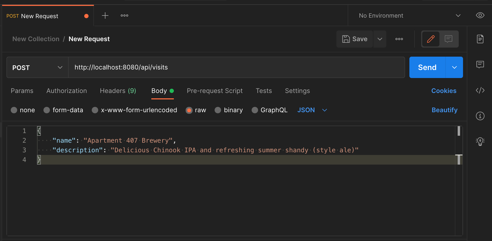
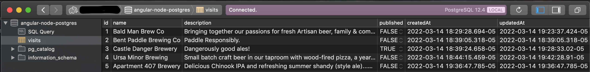
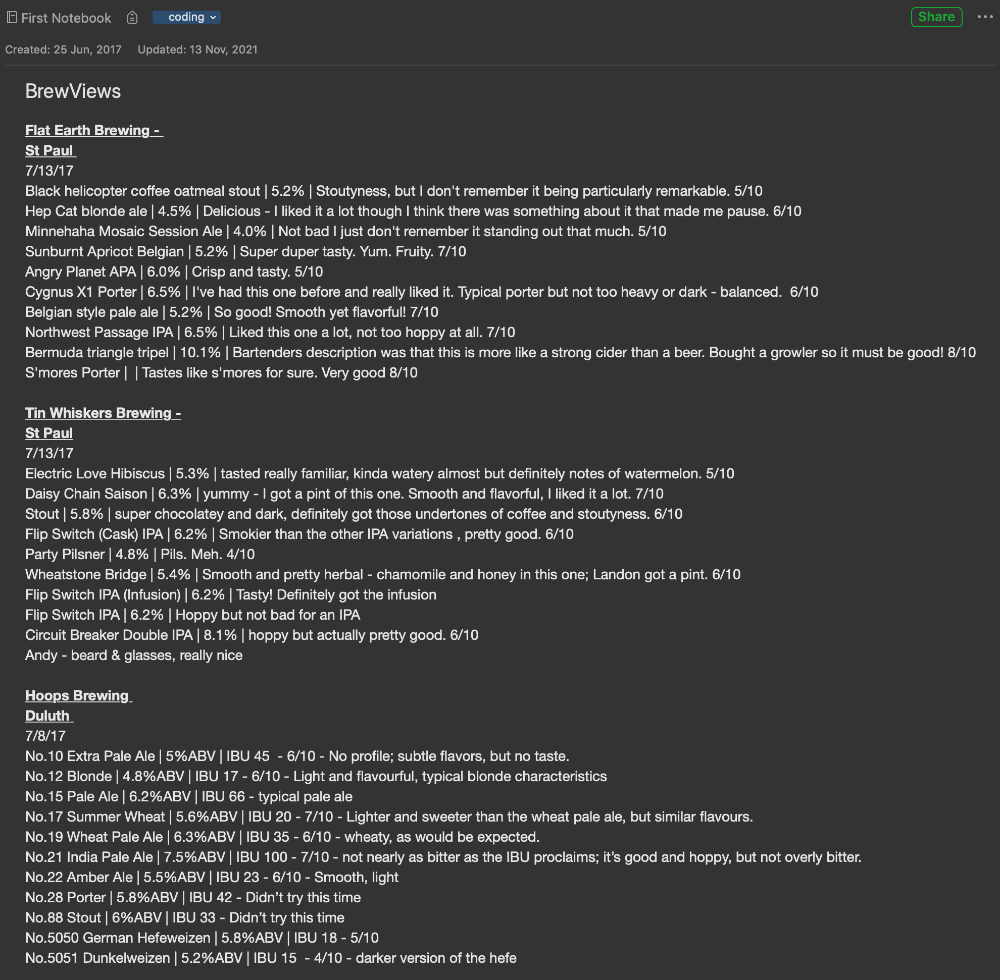

# Awesome Brew Views

It keeps track of your craft brewery visits so you don't have to.

### Run this project:

1) Clone this repository: `git clone git@github.com:cjaro/brewviewsmn.git awesomebrewviews`
2) Copy the backend database environment and populate your variables `cp backend/sample.env backend/.env`
3) Install packages: `cd backend && npm install` & `cd frontend && npm install`
4) Start the web server: `cd backend && npm start`
5) Use an API client like [Postman](https://www.postman.com/) or [Insomnia](https://insomnia.rest/) to post some data
    1) `{ "name": "My Favorite Brewery", "description": "Best brewery in the neighborhood!" }`
    2) 
6) Use a client like [Postico](https://eggerapps.at/postico/) or [Sqlectron](https://sqlectron.github.io/) to see the
   database
    1) 

## Project Description

This project emerged from an idea I had in 2016 when I began touring craft breweries around the Twin Cities
(Minneapolis-St.Paul) area. Not being a beer drinker or enjoyer before, I wanted a way to keep track of the brews I
found fantastic. In the beginning, I kept track of these visits on a note on my phone; however, after over five years
and a hundred breweries later, this note is too big to feasibly rely on anymore:

When I was a full-stack software engineering student at [Prime Digital Academy](primeacademy.io) in 2016-2017, I learned
the basics of building Single-Page Applications with Node.js, Express, AngularJS, and PostgreSQL. The first iterations
of this project began as a simply CRUD (Create-Read-Update-Delete) app that recorded visits to breweries and associated
beers per brewery.

### Original blurb:

> *Let’s say you’ve gone on a weekend visit to Duluth. You went to a couple of breweries in the area: you liked some
> beers, and you didn’t like others. You tell yourself that you’ve definitely got to remember this beer so you can pick
> some up when you get return home. You didn’t write anything down, but that’s all right: you’ll definitely remember.*
>
> *You get back home and think nothing more about breweries and their products (once the bloating has gone), other than
> to appreciate the great time and fond memories you now have. You swing by your local beer cave on your way home
> from work on Monday and realize there’s a problem: you’ve forgotten each one of the beers you tried, liked,
> and hated. Was it Bent Paddle or Castle Danger? Carmody? Canal Park? Fitgers?*
>
> *Unable to remember, you grab a 6-pack at random from a brewery you think might be one of the ones you liked. Upon
> returning home, you crack the top, take a sip, and are filled with the immediate regret and frustration that accompanies
> your wrong choice. The worst part is, you know you’ll forget this beer too. You’re doomed to make the same mistake again.*

## Final thoughts:

